## Artwork GallerySI — Kelompok 7 (TuhanMembersamai)


Proyek ini adalah aplikasi galeri karya (artwork sharing) berbasis Laravel. Pengguna dapat mengunggah karya, memberi komentar dan like, mengelola kategori, serta admin memiliki panel untuk manajemen post, kategori, dan activity log. Storage gambar diintegrasikan dengan Supabase Storage (public URLs) dan ada fallback ke storage lokal.

## Daftar Isi

- [Artwork GallerySI — Kelompok 7 (TuhanMembersamai)](#artwork-gallerysi--kelompok-7-tuhanmembersamai)
- [Daftar Isi](#daftar-isi)
- [Tentang](#tentang)
- [Fitur (Ringkasan)](#fitur-ringkasan)
- [Tech Stack](#tech-stack)
- [Instalasi \& Persiapan](#instalasi--persiapan)
- [Konfigurasi Supabase](#konfigurasi-supabase)
- [Role \& Permissions](#role--permissions)
- [Fitur Berdasarkan Role (penjelasan rinci)](#fitur-berdasarkan-role-penjelasan-rinci)
  - [Guest](#guest)
  - [User (Authenticated)](#user-authenticated)
  - [Admin](#admin)
- [Workflow (User \& Admin)](#workflow-user--admin)
  - [Upload Artwork (User)](#upload-artwork-user)
  - [Hapus Artwork (User)](#hapus-artwork-user)
  - [Moderasi / Manajemen (Admin)](#moderasi--manajemen-admin)
- [Screenshot](#screenshot)
  - [1. Halaman Login](#1-halaman-login)
  - [2. Halaman Utama](#2-halaman-utama)
  - [3. Halaman Profil](#3-halaman-profil)
  - [4. Form Upload Artwork](#4-form-upload-artwork)
  - [5. Form Edit Profil](#5-form-edit-profil)
  - [6. Halaman Notifikasi](#6-halaman-notifikasi)
  - [7. View Artwork](#7-view-artwork)
  - [8. Dashboard](#8-dashboard)
  - [9. Manage User](#9-manage-user)
  - [10. Manage Post](#10-manage-post)
  - [11. Detail Post](#11-detail-post)
  - [12. Manage Categories](#12-manage-categories)
  - [13. Add Category](#13-add-category)
  - [14. Activity Log](#14-activity-log)
- [Struktur Database](#struktur-database)
- [Relasi Database (Ringkas)](#relasi-database-ringkas)
- [Struktur Singkat (file/folder penting)](#struktur-singkat-filefolder-penting)
- [Troubleshooting Cepat](#troubleshooting-cepat)
- [Tips Debug cepat](#tips-debug-cepat)
- [Kontribusi](#kontribusi)
- [Lisensi](#lisensi)

## Tentang
Proyek ini adalah aplikasi galeri karya (artwork sharing) berbasis Laravel. Pengguna dapat mengunggah karya, memberi komentar dan like, mengelola kategori, serta admin memiliki panel untuk manajemen post, kategori, dan activity log. Storage gambar diintegrasikan dengan Supabase Storage (public URLs) dan ada fallback ke storage lokal.

## Fitur (Ringkasan)
- Upload artwork (gambar) dan simpan URL dari Supabase
- Lihat galeri (profil & eksplorasi publik)
- Komentar dan Like pada artwork
- Kategori dan pengelompokan artwork
- Profil pengguna dengan foto
- Halaman admin: kelola posts, categories, activity logs
- Pencatatan activity log (upload, delete, update)

## Tech Stack
- Backend: Laravel (PHP)
- Frontend: Blade + Bootstrap + custom CSS/JS
- Database: PostgreSQL (Supabase) atau yang dikonfigurasi di `.env`
- Storage: Supabase Storage (bucket `artworks`) dan fallback local disk
- HTTP client: Laravel HTTP Client / Guzzle

## Instalasi & Persiapan
1. Clone repo

```powershell
git clone https://github.com/aidilsaputrakirsan-classroom/final-project-cloud-computing-b-cc-kelompok-7-tuhanmembersamai.git
cd final-project-cloud-computing-b-cc-kelompok-7-tuhanmembersamai
```

2. Install dependencies

```powershell
composer install
npm install
```

3. Setup environment

```powershell
copy .env.example .env
php artisan key:generate
```

4. Migrate & seed

```powershell
php artisan migrate --seed
```

5. (Optional) buat symlink jika pakai storage lokal

```powershell
php artisan storage:link
```

6. Jalankan dev server

```powershell
php artisan serve
npm run dev
```

## Konfigurasi Supabase
Tambahkan variabel ini di `.env`:

```env
SUPABASE_URL=https://<your-project>.supabase.co
SUPABASE_SERVICE_ROLE_KEY=<service-role-key>
SUPABASE_BUCKET=artworks
```

PENTING: `SUPABASE_URL` harus lengkap (termasuk `https://`)—jika kosong upload akan mencoba memanggil path `/storage/v1/...` tanpa host, menghasilkan "cURL error 6: Could not resolve host: storage".


## Role & Permissions

Aplikasi menggunakan model role sederhana untuk membedakan hak akses. Secara default ada tiga tipe peran yang relevan untuk fitur galeri ini:

- **Guest (tidak terautentikasi)**: dapat melihat galeri publik dan halaman eksplorasi, tetapi tidak dapat mengunggah, memberi komentar, atau memberi like.
- **User (authenticated)**: dapat mengunggah karya, mengedit profil, memberi komentar dan like, serta menghapus karya miliknya sendiri.
- **Admin**: memiliki semua hak User ditambah kemampuan untuk mengelola kategori, melihat dan mengelola semua artwork, serta meninjau activity logs.

Contoh mapping permission (implementasi bisa menggunakan `spatie/laravel-permission` atau guard bawaaan):

- `artwork.create` — user dapat mengunggah artwork
- `artwork.update` — owner atau admin dapat mengubah metadata/artwork
- `artwork.delete` — owner atau admin dapat menghapus artwork
- `comment.create` — user dapat menambahkan komentar
- `like.create` — user dapat memberi like
- `category.manage` — admin dapat membuat/edit/hapus kategori
- `activity.view` — admin dapat melihat activity logs

## Fitur Berdasarkan Role (penjelasan rinci)

### Guest
- Akses: Tidak perlu login.
- Fitur utama:
  - Lihat galeri publik (semua artwork yang bersifat public).
  - Lihat halaman detail artwork (foto, deskripsi, jumlah like, komentar).
  - Menelusuri kategori dan filter.

### User (Authenticated)
- Akses: harus membuat akun dan login.
- Fitur utama & penjelasan:
  - Unggah Artwork (`artwork.create`): upload file gambar ke Supabase Storage, isi deskripsi, pilih kategori. Sistem menyimpan URL publik dan menambahkan record `artworks`.
  - Kelola Profil: mengubah nama, bio, foto profil. Foto profil dapat diunggah ke local storage atau Supabase sesuai konfigurasi.
  - Komentar (`comment.create`): menulis komentar pada artwork. Komentar disimpan di tabel `comments` dengan relasi ke `users` dan `artworks`.
  - Like (`like.create`): beri/angkat like pada artwork — disimpan di tabel `likes` untuk menghindari duplikasi.
  - Hapus Karya (`artwork.delete`): pengguna hanya dapat menghapus karya yang dimiliki sendiri; action ini menghapus record DB. (Catatan: penghapusan file dari Supabase Storage bersifat opsional / belum otomatis di versi ini — bisa ditambahkan.)
  - Melihat histori aktivitas pribadi (opsional jika tersedia di UI).

### Admin
- Akses: role admin (diterapkan via `role` atau permission set).
- Fitur utama & penjelasan:
  - Manajemen Artwork: melihat semua karya, menghapus karya bermasalah, atau mengedit metadata bila diperlukan (`artwork.update`, `artwork.delete`).
  - Kelola Kategori (`category.manage`): CRUD kategori sehingga admin dapat mengatur struktur kategori yang digunakan oleh user saat mengunggah.
  - Lihat Activity Log (`activity.view`): memonitor aksi penting seperti upload, delete, update, dan login user; memudahkan auditing dan moderasi.
  - Moderasi Konten: menandai/menghapus komentar tidak pantas, memblokir user jika perlu (fitur ini bergantung pada implementasi tambahan).

## Workflow (User & Admin)

### Upload Artwork (User)
1. User pilih menu Unggah → isi deskripsi + pilih file gambar + kategori.
2. Frontend submit form ke `ArtworkController::store()`.
3. Controller memanggil `SupabaseStorageService::upload()`:
	 - Service membaca file, membangun URL upload: `{$SUPABASE_URL}/storage/v1/object/{bucket}/{path}`
	 - Mengirim POST dengan body file ke Supabase Storage.
4. Supabase merespon → service mengembalikan public URL: `{$SUPABASE_URL}/storage/v1/object/public/{bucket}/{path}`.
5. Controller menyimpan record `artworks` dengan `image` berisi URL publik.
6. User dapat melihat karya di profil dan gallery publik.

### Hapus Artwork (User)
1. User klik Hapus pada karya sendiri.
2. Controller menghapus record DB; (opsional) operasi delete ke Supabase Storage belum diimplementasikan di versi ini.

### Moderasi / Manajemen (Admin)
1. Admin membuka panel admin → bisa melihat semua artworks.
2. Admin dapat menghapus/mengelola kategori dan melihat activity logs.

## Screenshot

### 1. Halaman Login
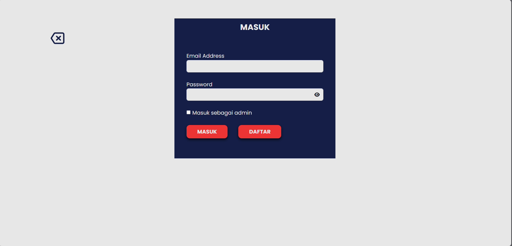
*Halaman login dengan form email dan password*

### 2. Halaman Utama
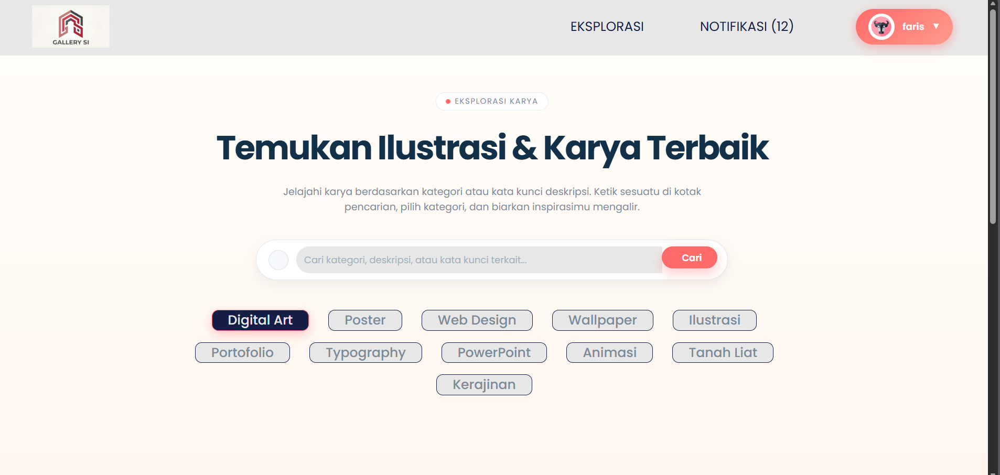
*Halaman utama yang menampilkan gambar*

### 3. Halaman Profil
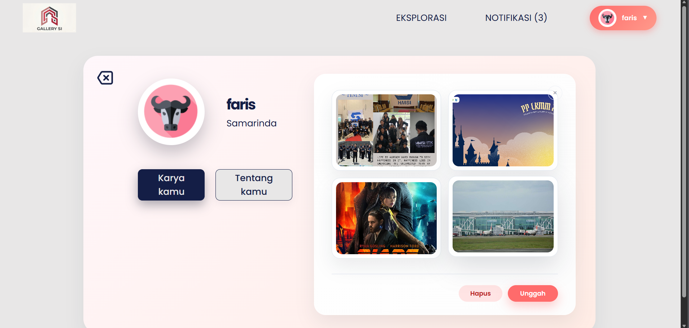
*Halaman profil dengan foto yang terunggah dan informasi akun*

### 4. Form Upload Artwork
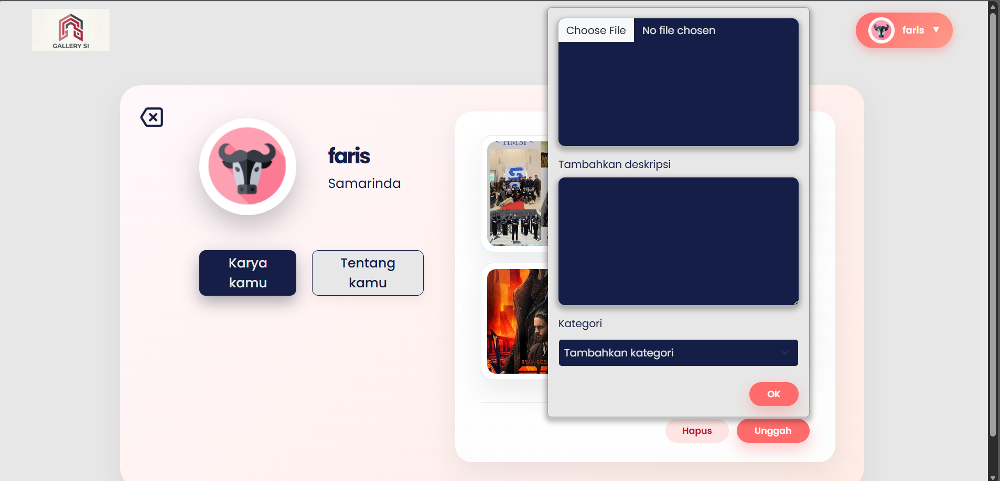
*Form untuk mengunggah foto baru*

### 5. Form Edit Profil
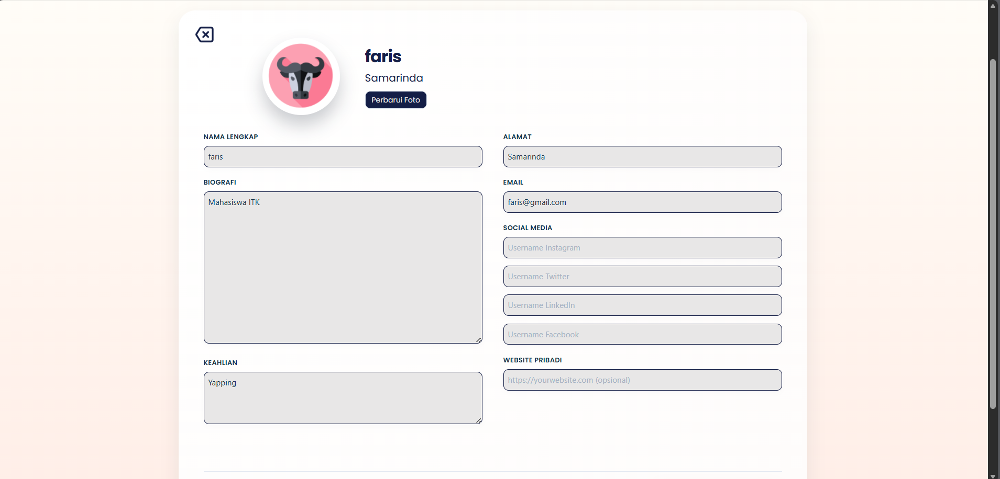
*Form untuk mengubah informasi profil*

### 6. Halaman Notifikasi
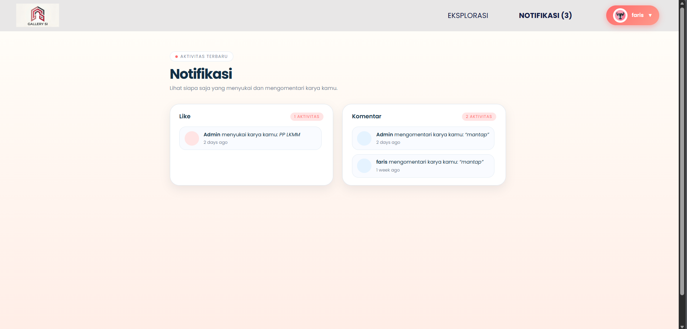
*Halaman notifikasi yang menampilkan aktivitas pengguna lain terhadap karya yang diposting*

### 7. View Artwork
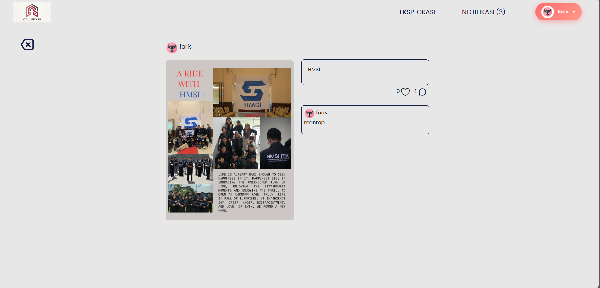
*Halaman untuk menampilkan detail gambar*

### 8. Dashboard
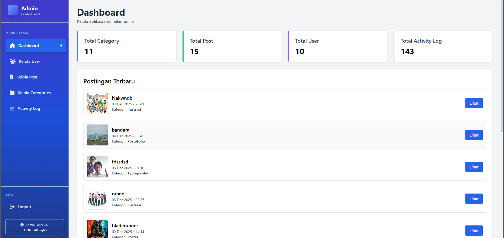
*Halaman dashboard untuk menampilkan informasi terkini dari aplikasi*

### 9. Manage User
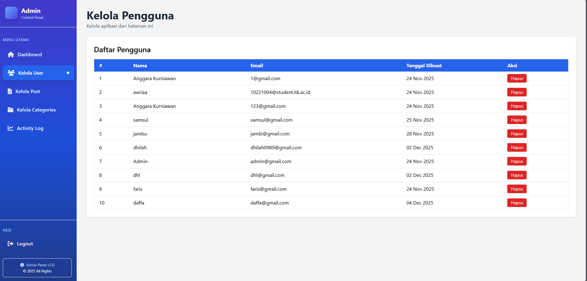
*Halaman kelola user untuk melihat seluruh pengguna yang terdaftar dan menghapus pengguna*

### 10. Manage Post
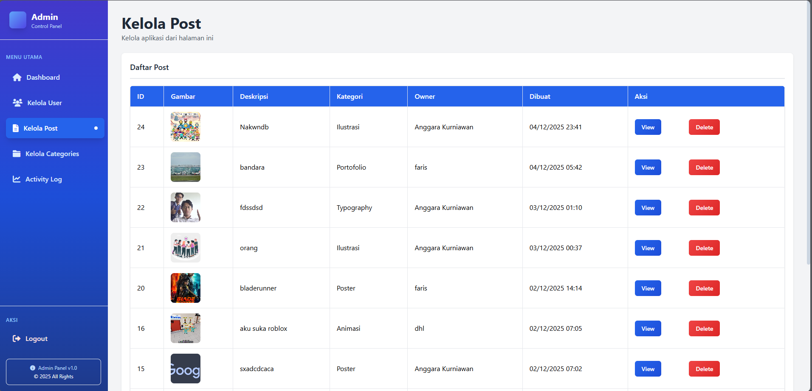
*Halaman kelola post untuk melihat seluruh post yang ada dan menghapus post*

### 11. Detail Post
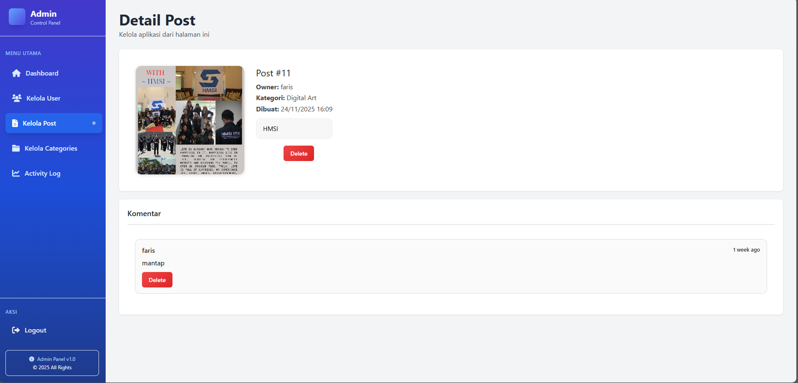
*Halaman yang menampilkan detail post dan komentar pada post tersebut, serta menghapus komentar*

### 12. Manage Categories
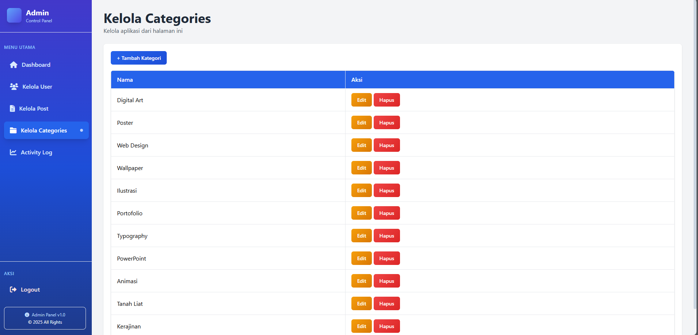
*Halaman untuk melihat dan mengelola category yang telah dibuat*

### 13. Add Category
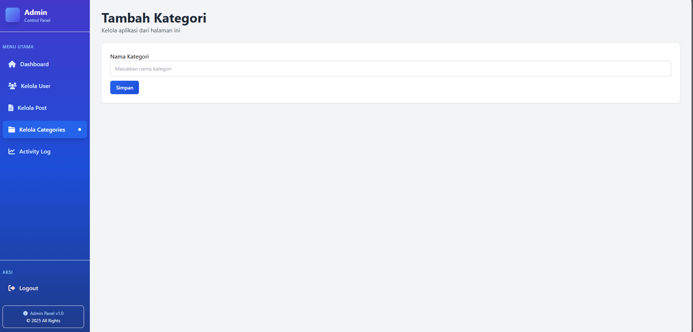
*Form untuk menambahkan category baru*

### 14. Activity Log
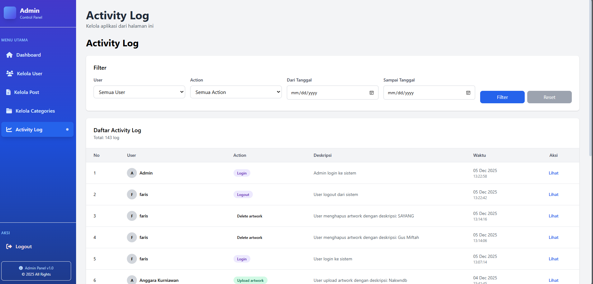
*Halaman untuk melihat aktivitas yang dilakukan oleh seluruh pengguna*

## Struktur Database
Berikut tabel utama yang dipakai di aplikasi ini (ringkasan):

- `users` — pengguna (id, name, email, password, image, role, ...)
- `artworks` — karya (id, user_id, image, description, category_id, created_at)
- `categories` — kategori artwork (id, name)
- `comments` — komentar (id, artwork_id, user_id, content, created_at)
- `likes` — like (id, artwork_id, user_id)
- `posts` — (opsional, jika ada fitur post/admin)
- `activity_logs` — catatan aktivitas (id, user_id, action, metadata, created_at)

## Relasi Database (Ringkas)
- `User` hasMany `Artwork` (users.id -> artworks.user_id)
- `Artwork` belongsTo `User` (artworks.user_id -> users.id)
- `Artwork` belongsTo `Category` (artworks.category_id -> categories.id)
- `Artwork` hasMany `Comment` (comments.artwork_id -> artworks.id)
- `Artwork` hasMany `Like` (likes.artwork_id -> artworks.id)
- `User` hasMany `Comment` and `Like` (comments.user_id, likes.user_id)
- `ActivityLog` belongsTo `User` (activity_logs.user_id -> users.id)

Contoh diagram relasi (ER-style, ASCII):

```
users (1)  ─── (n) artworks
users (1)  ─── (n) comments
users (1)  ─── (n) likes
users (1)  ─── (n) activity_logs

categories (1)  ─── (n) artworks

artworks (1)  ─── (n) comments
artworks (1)  ─── (n) likes

# Ringkasan relasi utama:
# - Satu user dapat memiliki banyak artwork, komentar, like, dan activity log
# - Satu artwork dimiliki oleh satu user dan dapat memiliki banyak komentar & like
# - Satu kategori dapat memiliki banyak artwork
```

## Struktur Singkat (file/folder penting)
- `app/Services/SupabaseStorageService.php` — service untuk upload ke Supabase
- `app/Http/Controllers/User/ArtworkController.php` — controller upload dan list karya pengguna
- `app/Models/Artwork.php`, `Category.php`, `Comment.php`, `Like.php`, `ActivityLog.php` — model data utama
- `resources/views/pages` — tampilan: profile, exploration, detail, admin pages
- `config/filesystems.php` — konfigurasi disk Supabase (endpoint pada `disks.supabase.endpoint`)

## Troubleshooting Cepat
- Error "cURL error 6: Could not resolve host: storage" → cek `SUPABASE_URL` di `.env`, jalankan:

```powershell
php artisan config:clear
php artisan cache:clear
php artisan config:cache
```

- Jika gambar tidak tampil dan URL disimpan penuh (https://...), pastikan view tidak memanggil `asset('storage/' . $image)` pada URL penuh — gunakan pola: jika `image` dimulai dengan `http`/`https` pakai langsung, jika tidak pakai `asset('storage/...')`.

## Tips Debug cepat
- Pastikan `.env` berisi `SUPABASE_URL` dan `SUPABASE_SERVICE_ROLE_KEY`.
- Hapus cache konfigurasi bila mengganti `.env` di server:

```powershell
php artisan config:clear
php artisan cache:clear
php artisan config:cache
```

- Periksa `storage/logs/laravel.log` untuk baris log yang memuat `Supabase upload URL:` (sudah ditambahkan di service) — itu akan menunjukkan URL yang dipakai untuk upload.
---

## Kontribusi
- Fork, buat branch fitur, commit, push, PR. Ikuti standar PSR-12.

## Lisensi
- MIT

---

Perubahan ini menambahkan TOC, memisahkan fitur User/Admin, menambahkan struktur DB, relasi, dan workflow upload/hapus/manajemen.
