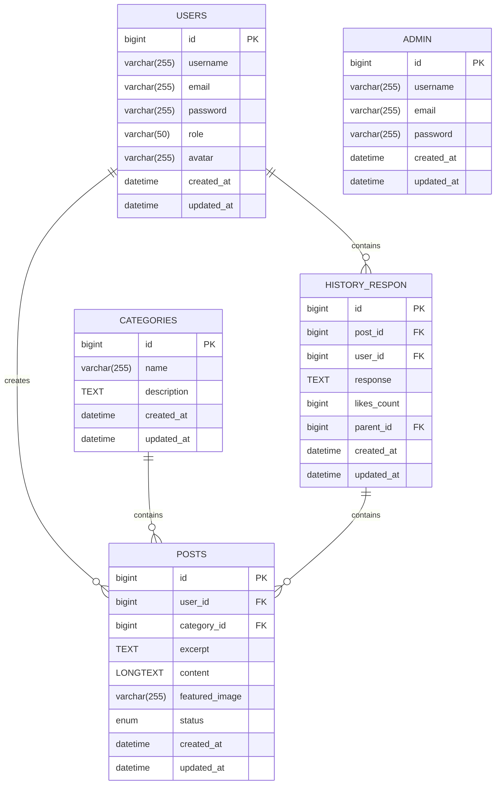

```mermaid
erDiagram
    USERS ||--o{ POSTS : creates
    USERS ||--o{ HISTORY_RESPON : contains
    CATEGORIES ||--o{ POSTS : contains
    HISTORY_RESPON ||--o{ POSTS : contains

    USERS {
        bigint id PK
        varchar(255) username
        varchar(255) email
        varchar(255) password
        varchar(50) role
        varchar(255) avatar
        datetime created_at
        datetime updated_at
    }
    
    CATEGORIES {
        bigint id PK
        varchar(255) name
        TEXT description
        datetime created_at
        datetime updated_at
    }
    
    POSTS {
        bigint id PK
        bigint user_id FK
        bigint category_id FK
        TEXT excerpt
        LONGTEXT content
        varchar(255) featured_image
        enum status
        datetime created_at
        datetime updated_at
    }
    
    HISTORY_RESPON {
        bigint id PK
        bigint post_id FK
        bigint user_id FK
        TEXT response
        bigint likes_count
        bigint parent_id FK
        datetime created_at
        datetime updated_at
    }
    
    ADMIN {
        bigint id PK
        varchar(255) username
        varchar(255) email
        varchar(255) password
        datetime created_at
        datetime updated_at
    }
```