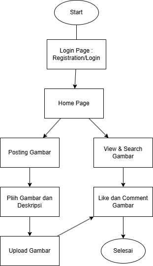
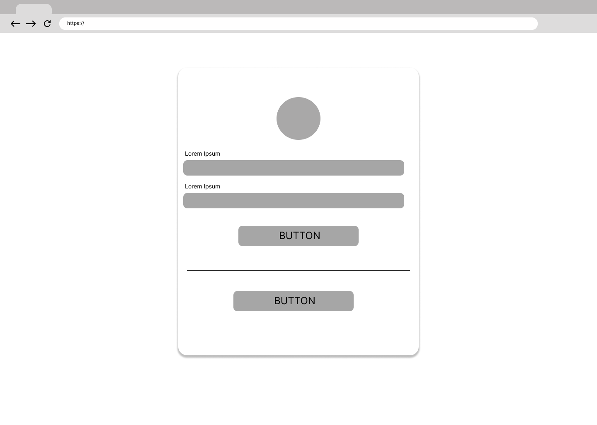
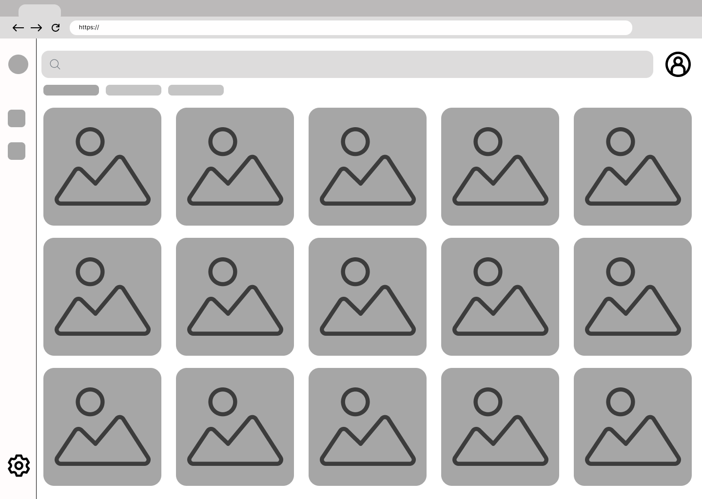
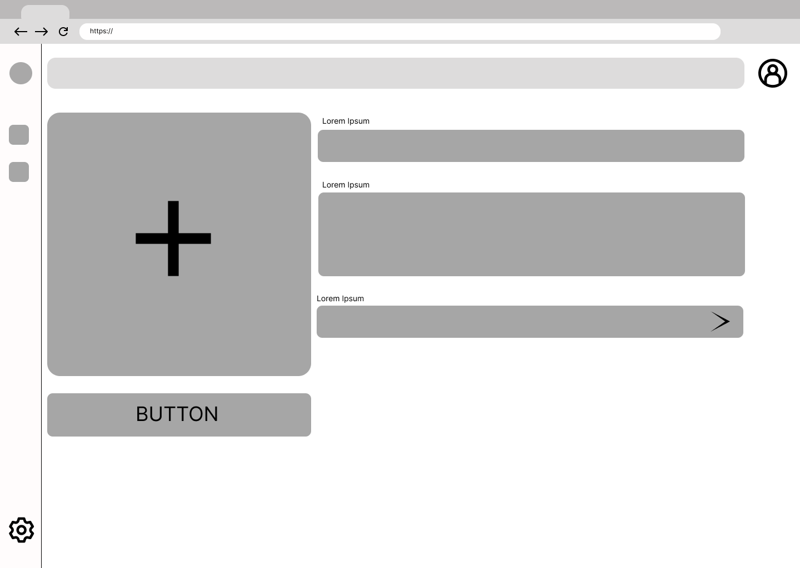
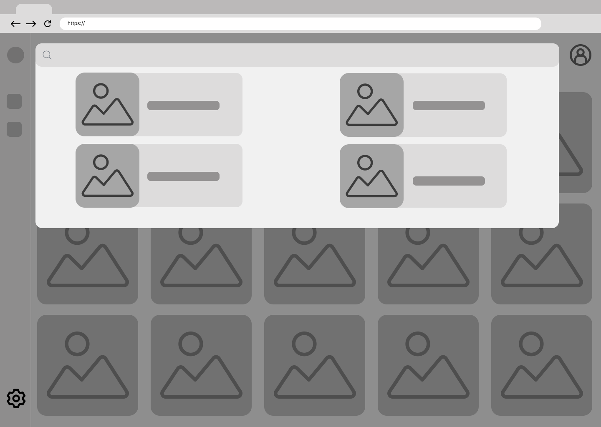
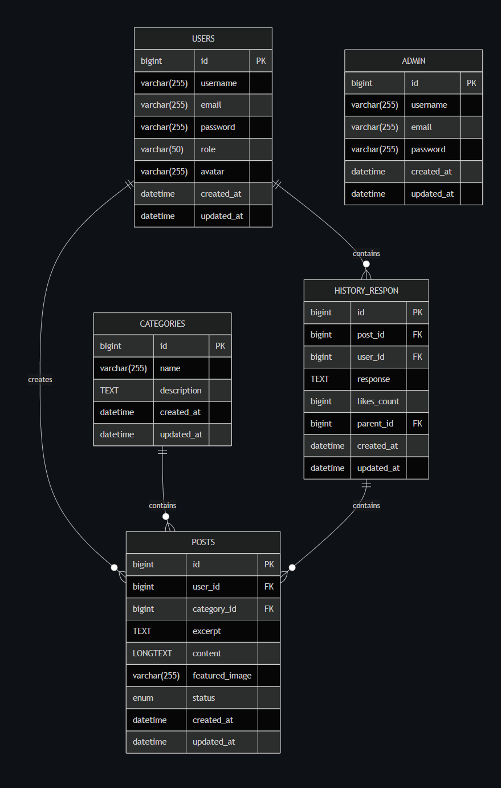

# TIM TuhanMembersamai
Anggota	:  
1. Maria Reminiscere Siregar Silo NIM 10221004 
2. Faris Razzan Rahmatullah NIM 10221064
3. Anggara Kurniawan NIM 10221074
4. Nadhilah Nur Amalina NIM 10221084 

# **WEBSITE SI-ART**

## 1. Deskripsi Aplikasi
SI-ART merupakan aplikasi berbasis web yang dikembangkan sebagai wadah bagi para pecinta seni untuk berbagi, menemukan, dan mengapresiasi berbagai karya seni digital. Pengguna dapat menjelajahi beragam karya visual seperti ilustrasi, desain grafis, hingga karya digital lainnya yang diunggah oleh pengguna lain. Melalui SI-ART, pengguna dapat menampilkan hasil karyanya sendiri, memberikan inspirasi kepada orang lain, serta membangun komunitas kreatif yang saling mendukung.

Aplikasi ini dirancang dengan antarmuka yang sederhana dan mudah digunakan agar dapat diakses oleh berbagai kalangan. Pengguna dapat melakukan registrasi, masuk ke akun pribadi, serta mengelola karya seni yang telah mereka unggah. Selain itu, SI-ART menyediakan fitur interaktif seperti “like” dan “komentar” yang memungkinkan pengguna berinteraksi secara langsung dengan pengguna lain. Fitur pencarian juga disediakan agar pengguna dapat dengan mudah menemukan karya berdasarkan kata kunci tertentu, sedangkan fitur unduh memungkinkan pengguna menyimpan karya yang mereka sukai sebagai sumber inspirasi pribadi.

Tujuan utama dari pengembangan SI-ART adalah menciptakan ruang digital yang inklusif bagi komunitas kreatif untuk mengekspresikan diri, berbagi ide, dan saling mengapresiasi karya seni digital. Dengan kehadiran SI-ART, diharapkan para pengguna dapat lebih termotivasi untuk mengembangkan kreativitas, memperluas jejaring, dan menumbuhkan budaya berbagi di dunia seni digital.

## 2. Target User
Website SI-ART ditujukan untuk seluruh kalangan masyarakat umum berusia 15 tahun ke atas, tanpa batasan latar belakang profesi maupun pengalaman seni. Secara lebih spesifik, target pengguna meliputi:
- Pelajar dan Mahasiswa > yang ingin memamerkan hasil tugas atau karya digitalnya serta mencari inspirasi dari seniman lain.
- Desainer Grafis dan Ilustrator Pemula >  yang membutuhkan wadah untuk membangun portofolio online secara sederhana.
- Pencinta Seni dan Kolektor Digital > yang ingin menemukan tren karya baru, menyimpan inspirasi visual, dan berinteraksi dengan seniman lain.
- Komunitas Kreatif & Pengajar Seni >  yang dapat menggunakan platform ini untuk berbagi hasil karya dan memberikan apresiasi terhadap karya peserta didik atau anggota komunitasnya.

## 3. Fitur Utama
- **Login Admin & User**
  - User : Dapat melakukan registrasi, login dan mengelola postingan pribadi.
  - Admin : Memiliki akses untuk memantau seluruh postingan dan aktivitas pengguna.

- **Homepage** 
  Halaman utama yang menampilkan semua karya (Postingan) yang telah di unggah oleh pengguna lain

- **Posting (CRUD)**
  Pengguna dapat mengunggah (gambar + deskripsi), mengedit dan menghapus karya yang telah di unggah. Ini memudahkan pengguna berinteraksi dengan pengguna lain.

- **Like**
  Pengguna dapat menyukai postingan karya seni yang mereka sukai, dan jumlah like akan ditampilkan pada setiap postingan.

- **Comment**
  Pengguna dapat memberikan komentar pada postingan pengguna lain.

- **Download**
  Pengguna dapat mengunduh gambar dari postingan pengguna lain.

- **Search**
    Pengguna dapat mencari postingan berdasarkan kata kunci (misal: “ilustrasi”, dsb;)

## 4. User Flow

Berikut alur penggunaan SI - ART oleh pengguna :
- **Login** : Pengguna akan diarahkan ke halaman Login. Pengguna baru dapat melakukan registrasi terlebih dahulu untuk membuat akun, sedangkan pengguna lama dapat langsung masuk menggunakan akun yang sudah ada.
  
- **Homepage** : Setelah berhasil login, pengguna diarahkan ke halaman utama yang menampilkan berbagai karya seni digital dari pengguna lain. Di halaman ini, pengguna dapat mengakses beberapa fitur, seperti Posting dan View

- **Posting gambar** : Pengguna dapat mengunggah karya mereka dengan memilih gambar dan menambahkan deskripsi.
  
- **Upload Gambar** : Karya yang telah dipilih akan diunggah dan ditampilkan di halaman utama.

- **View & Search Gambar** : Pengguna dapat menelusuri atau mencari karya berdasarkan kata kunci tertentu

- **Like & Comment** : Pengguna dapat memberikan apresiasi terhadap karya yang mereka sukai melalui fitur like serta memberikan tanggapan melalui kolom komentar.

## 5. Mockup 
- **Login**

Halaman ini dirancang sebagai tampilan tempat pengguna melakukan proses login atau registrasi. Terdapat dua kolom yang akan berisi email dan password., dan dua tombol utama yaitu Login dan Register.

- **Homepage**

halaman Home dirancang untuk menampilkan berbagai karya seni digital(Postingan) dari pengguna lain dalam bentuk grid sederhana. Terdapat elemen navigasi di bagian atas seperti Home, Post, Search, dan Profile. Setiap gambar menampilkan nama pengguna, jumlah like, serta jumlah komentar untuk memberikan gambaran interaksi antar 

- **View**

halaman ini menampilkan tampilan detail dari satu postingan pengguna. Elemen yang terdapat di dalamnya meliputi gambar utama berukuran besar, deskripsi karya/postingan, serta tombol interaksi seperti Like, Comment, dan Download. Bagian bawah halaman menampilkan kolom komentar.

- **Post**

Halaman Post dirancang untuk memberikan ruang bagi pengguna mengunggah karya seni digital mereka. Halaman ini berisi kolom input deskripsi dan tombol Upload. Pengguna dapat memilih file gambar yang ingin diunggah, dan setelah proses unggah selesai, karya tersebut akan muncul pada halaman Home.

- **Search**

Halaman search menampilkan search bar di bagian atas untuk memudahkan pengguna mencari karya berdasarkan kata kunci tertentu. Hasil pencarian divisualisasikan dalam bentuk grid gambar yang menampilkan karya sesuai dengan kata kunci yang dimasukkan.

## 6. Database Schema

Skema desain database dapat dilihat pada dokumentasi berikut
[Database Schema](database/schema.md)
[ERD](database/erd.md)